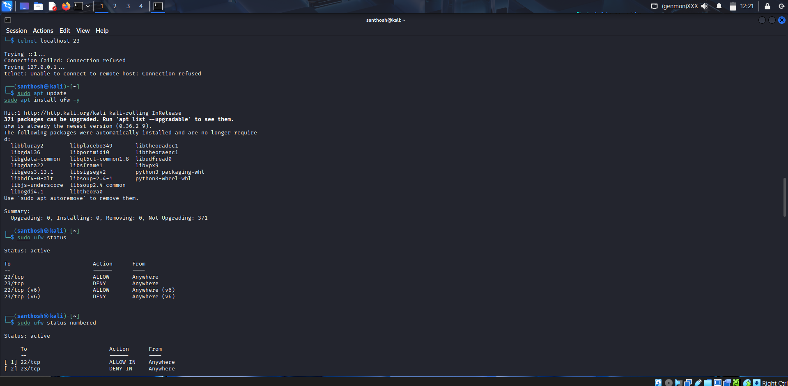
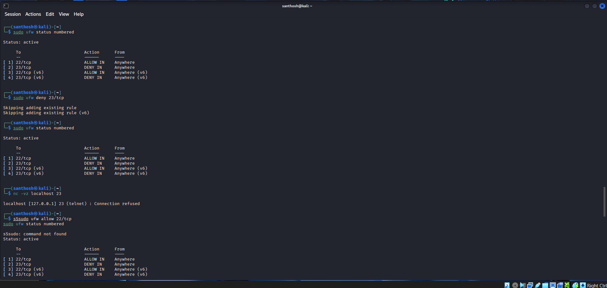
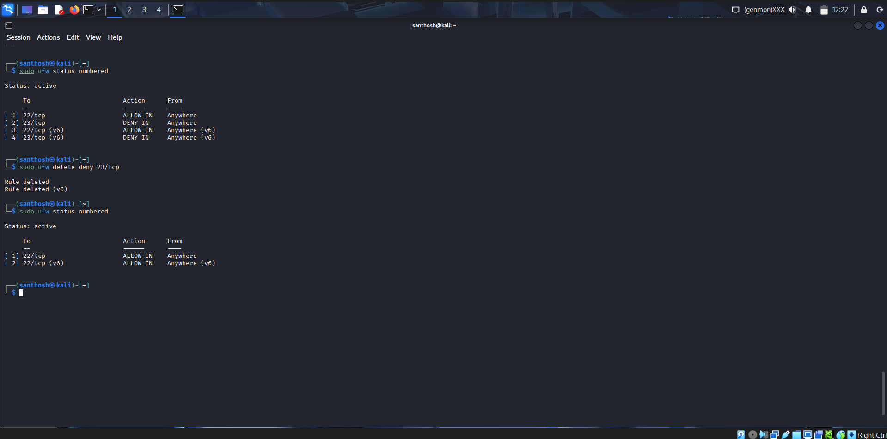

# 🔒 Firewall Configuration Task – Internship

This project demonstrates how to configure and test firewall rules on **Kali Linux** using **UFW (Uncomplicated Firewall)**.

---

## Steps Performed

1. **Enable Firewall**  
   Activated UFW to start filtering network traffic:  
   ```bash
   sudo ufw enable
   ```
   📸 Screenshot:  
   

2. **List Current Rules**  
   Displayed existing rules with:  
   ```bash
   sudo ufw status numbered
   ```
   Output showed SSH (22/tcp) allowed and Telnet (23/tcp) denied.  
   📸 Screenshot:  
   

3. **Block Telnet (Port 23)**  
   Added a deny rule:  
   ```bash
   sudo ufw deny 23/tcp
   ```
   Confirmed with `sudo ufw status numbered`.

4. **Test the Rule**  
   Verified Telnet was blocked using Telnet and Netcat:  
   ```bash
   telnet localhost 23
   nc -vz localhost 23
   ```
   Both returned **Connection refused**.  
   📸 Screenshot:  
   

5. **Allow SSH (Port 22)**  
   Ensured SSH remained accessible:  
   ```bash
   sudo ufw allow 22/tcp
   ```
   Verified in `ufw status`.

6. **Remove Test Rule (Telnet Block)**  
   Deleted the Telnet deny rule to restore the firewall state:  
   ```bash
   sudo ufw delete deny 23/tcp
   ```
   Final rules allowed only SSH (22/tcp).  
   📸 Screenshot:  
   

---

## Commands Used
```bash
sudo ufw enable
sudo ufw status numbered
sudo ufw deny 23/tcp
telnet localhost 23
nc -vz localhost 23
sudo ufw allow 22/tcp
sudo ufw delete deny 23/tcp
```

---

## Firewall Summary
A **firewall** acts as a security filter between a system and external traffic.  
- **Allow rules** permit safe traffic (e.g., SSH on port 22).  
- **Deny rules** block unsafe or unused services (e.g., Telnet on port 23).  
By configuring firewall rules, we minimize exposure to attacks and ensure only authorized connections are allowed.

---

✅ **Task Completed Successfully**
